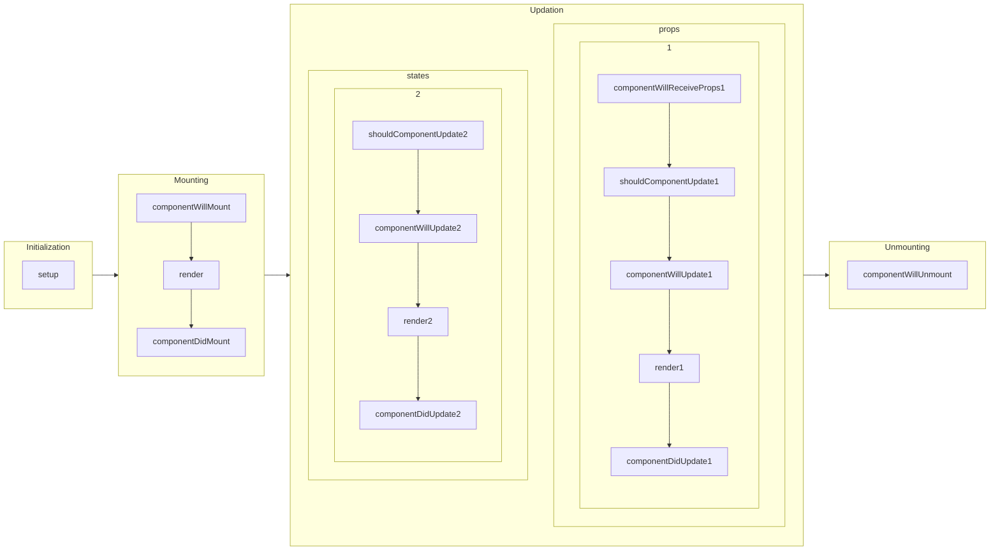

# Desenvolvimento de aplicação para internet com ReactJS

**Instrutor**: Eduardo Costa | **Posição**: Front-end Engineer na TrackSale


## 1. Trabalhando com estilos em elementos e componentes

### 1.1 CSS em Componentes e Elementos

Existem três maneiras de estilizar um elemento

1. **Inline**: atribuição das propriedades ao elemento por meio ta propriedade `style`, por meio de arquivos `JSON`, na qual as tags são escritas em **camelCase**

   ```jsx
   const divSyle = {
       color: 'blue',
       backgroundImage: 'url(' + imgUrl + ')'
   }
   
   const Component = () => {
   	return(
       	<div style={divStyle}>Hello World</div>
       )
   }
   ```

   

2. **Classes**: atribuir classes às tags e importar um arquivo CSS comum

3. **CSS in JS**: o JS gera o próprio CSS 

   **Instalação**

   ```
   npm install --save styled-components
   ```

   **Exemplo**

   ```jsx
   const DivStyle = styled.div`
   	color: blue;
   	backgrpund: url('${props => props.imageUrl}')
   `
   
   function Component() {
       const url = 'https://'
       return(
       	<DivStyle imageUtl={url}>Hello World</DivStyle>
       )
   }
   ```


#### Resumo de prós e contras

|  Tipo   |                          Inline                           |                           Classes                           |                          CSS in JS                           |
| :-----: | :-------------------------------------------------------: | :---------------------------------------------------------: | :----------------------------------------------------------: |
|  Prós   | Maneira mais prática, a justes rápidos e testes de estilo |               Maneira modular de criar o CSS                | Facilidade para remover CSS, criação de estilos dinâmicos, performance, injeção automática de prefixos vendor |
| Contras |                    Difícil manutenção                     | Difícil manutenção, pouca flexibilidade, conflito com nomes |                                                              |


### 1.2 Stateful vs Stateless

#### Ciclo de vida


#### Stateful
* Possui gerenciamento de estados no componente
* Implementado utilizando **classes** (com **Hooks**, podem ser implementados por **funções**)
* Os estados são imutáveis: a cada atualização, os antigos são destruídos e os novos são criados

#### Stateless
* Não possui gerenciamento de estados no componente

* Implementado utilizando **funções**

* Utilizado para renderização de imagens e ícones

#### Hooks

* `useState`: retorna array de dois elementos, o state e um setter, e recebe o estado incial
* Trouxe a definição de **Function Components**, que podem ser stateful ou stateless, e **Class Components**, que são stateless


### 1.3 Introdução a fomulários no ReactJS

Em HTML, os elementos `<input>`, `<textarea>`, `<select>` têm um estado interno, mantido pelo DOM. Em React, podemos controlar estes estados.


#### Componente controlado

> *Estado controlado pelo React*

Os elementos citados aceitam um atributo `value`, que pode ser atrelado a algum estado, e que pode ser alterado usando o atributo `onChange`, que receberá uma função que faz uso do `setState`.

Em `checkbox` e `radiobutton`, o estado deve ser vinculado ao atributo `checked`.


#### Componente não controlado

> *O estado do DOM é somente observado pelo React, por meio de uma referência*

Utilizado somente na `<input>`, que é read-only; não recomendado para outros casos.

Um objeto instanciado por `React.creacteRef()` é passado ao atributo `ref` da tag `<input>`. Na função de manipulação da sumbissão, o valor atual da tag pode ser acessado pelo o atributo `current` do objeto de referência.


#### Bibliotecas

Há algumas bibliotecas que deixam o trabalho com forms menos verboso

* Formik (recomendado pela documentação ReactJS)
* Redux-forms

