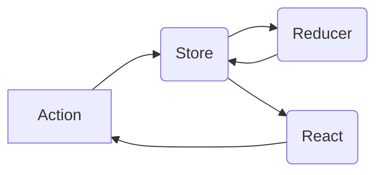

# Desenvolvimento de aplicação para internet com ReactJS

**Instrutor**: Eduardo Costa | **Posição**: Front-end Engineer na TrackSale


## 2. Introdução ao Redux e fluxos da arquitetura com ReactJS

### 2.1 Introdução ao Flux

> Arquitetra para **comunicação entre componentes**, padrão de projeto para tráfego de dados de maneira unidirecional

#### Arquitetura (ordem de comunicação)

1. **Action**: formata a mensagem a ser enviada
2. **Dispatcher**: redireciona a mensagem para a store adequada
3. **Store**: guarda a informação e faz todas as  alterações 
4. **View**: middleware entre Store e a tela

#### Implementações

* Redux
* ...

### 2.2 O que é Redux

> Implementação de Flux, com algumas direfenças



#### Arquitetura

1. **Action**: retorna um objeto formatado, sem enviar ao dispatcher (que não existe), solicitando uma alteração de estado

2. **Store**: armazena todos os estados; funciona como um caminho intermediário para que componentes que não são parentes em primeiro grau possam trocar dados, sem que seus parentes intermediários também precisem fazê-los.

   

3. **Reducers**: divide os estados em pequenos reducers, que retornam o valor do estado

4. **View**: root-component, que traz alguns conceitos novos

   * **Provider**: facilita que os child elements se conectem à store
   * **connect()**: HOC
   * **selector**: função que define os estados a passar como props


#### Princípios

1. Uma única store
2. States são read-only
3. Mudanças são feitas com *pure function*


### 2.3 React + Redux

#### Installção

```bash
npm i react-redux
npm i -D redux-devtools
```


