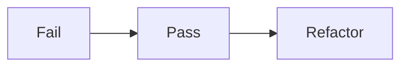

# Desenvolvimento de aplicação para internet com ReactJS

**Instrutor**: Eduardo Costa | **Posição**: Front-end Engineer na TrackSale


## 4. Conceitos aplicados à qualidade de código e automação de testes em React

### 4.1 TDD com Jest

> **T**est-**D**rive **D**evelopment

* Escrita dos testes antes da implementação da funcionalidade



#### Vertentes

* Teste unitário: funções, componentes, serviços
* Teste End-to-End (E2E): teste de fluxo

#### Bibliotecas

* [Jest](http://jestjs.io): usa a linguagem Jasmine, tem *code-coverage*
* React-testing-Library
* Shallow
* Enzyme
* Chai
* Mocha
* Selenium
* Puppeteer

#### Jest

##### `soma.js`

```js
export default function soma(a, b) = {
    return a + b
}
```

##### `soma.test.js`

```js
import { soma } from './soma'

describe('testando função soma', () => {
	it('A soma deve ser 3', () => {
		const res = soma(1, 2)
		expect(res).toBe(3)
	})
})
```


#### React-testing-Library

##### Instalação

```bash
yarn add --dev @testing-library/react
yarn add --dev @testing-library/jest-dom/extend-expect	
```

##### Componente

```js
import React from 'react'

const Basic = (props) => (
	<p>Meu nome é {props.name}</p>
)

export default Basic
```

##### Teste

```jsx
import React from 'react'
import Basic from './Basic'
import { render } from '@testing-library/react'
import '@testing-library/jest-dom/extend-expect'

describe('Testando Basic', () => {
    it('O componente Basic deve renderizar corretamente', () => {
		const {baseElement} = render(<Basic name='Componente' />)
        expect(baseElement).toHaveTextContent('Meu nome é Componente')
    })
})
```

##### Componentes com Redux

* Criar uma store de teste
* Fazer um wrapper


### 4.2 BDD com Jest

> **B**ehavior-**D**riven **D**evelopment

* Une especificação, teste automatizado e premissa de teste

* Sintaxe *Gherkin*

  - Funcionalidade

  - Cenário --> Dados, Quando, E, Então

#### Cucumber

##### Instalação

```bash
yarn add --dev jest-cucumber
```

##### `soma.feature`

```
Feature: Soma um Par
	Scenario: soma 1 + 2 resulta em 3
		Given 1
		When soma 2
		Then a soma é 3
```


### 4.3 Debugging


### 4.4 Tratamento de erros


